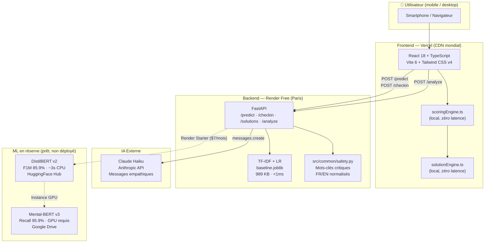
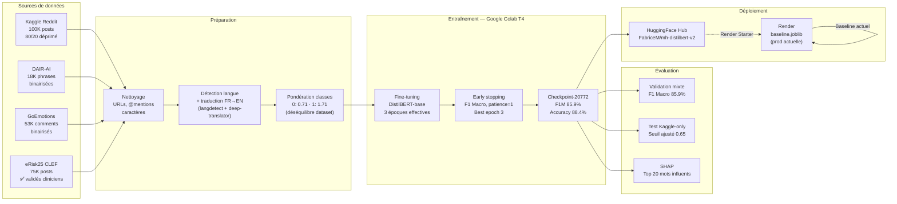
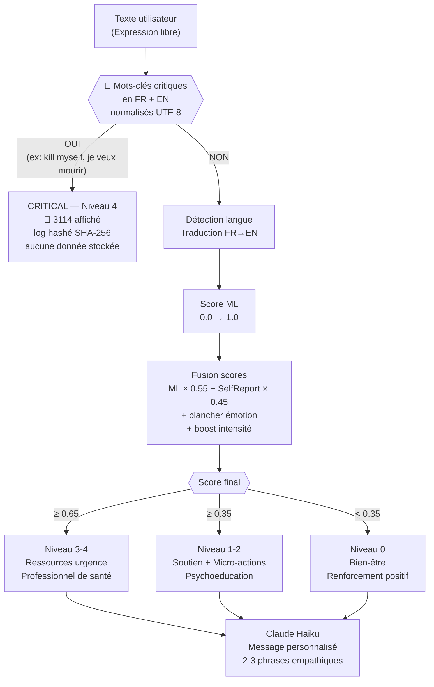
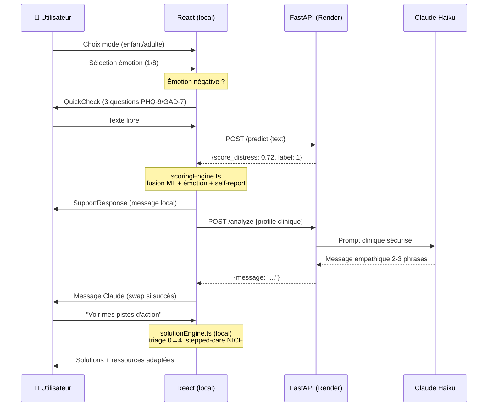
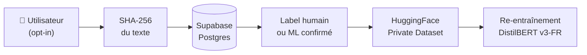
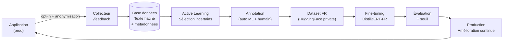

# Mental Health Signal Detector — Document de synthèse

**Artefact School of Data · Bootcamp Data Science · Mars 2026**

---

## 0. Cheminement du projet

```
PHASE 1 — NLP Pipeline                        (semaine 1-2)
  ├── Baseline TF-IDF + Logistic Regression  → 78% accuracy, interprétable, <1ms
  ├── DistilBERT v1 sur DAIR-AI 16K          → 96.8% F1 (sur-entraîné, distribution shift)
  └── Décision : baseline en prod, DistilBERT à ré-entraîner

PHASE 2 — Application React                   (semaine 2-3)
  ├── 6 écrans : Welcome → Émotion → QuickCheck → Expression → Support → Solutions
  ├── Fusion ML + émotion + questionnaire clinique PHQ-9/GAD-7
  ├── Détection de masquage (joie déclarée + texte négatif)
  └── Mode enfant / adulte, accessibilité WCAG 2.1 AA

PHASE 3 — Moteur de recommandation + LLM      (semaine 3)
  ├── Stepped-care NICE : 5 niveaux de triage (0→4)
  ├── 8 émotions × 5 niveaux × 2 modes = 80 profils de réponse
  ├── Claude Haiku (Anthropic API) : messages empathiques personnalisés
  └── 3114 aux niveaux 3 et 4 (décision clinique)

PHASE 4 — Qualité & Sécurité                 (semaine 3-4)
  ├── 348 tests : 150 pytest + 180 Vitest + 18 Playwright
  ├── CI/CD GitHub Actions (ruff, bandit, trivy, gitleaks, pip-audit)
  ├── 4 revues de sécurité (OWASP, rate limiting, CORS, RGPD)
  └── Filet de sécurité absolu : mots-clés critiques AVANT le ML

PHASE 5 — DistilBERT v2 + eRisk25            (semaine 4)
  ├── Dataset enrichi : Kaggle + DAIR-AI + GoEmotions + eRisk25 = 246K exemples
  ├── eRisk25 (CLEF 2025) : 75 700 posts cliniquement validés → données gold
  ├── Entraînement Google Colab T4 (~3h) → F1 Macro 85.9%, best epoch 3
  ├── Push HuggingFace Hub : FabriceM/mh-distilbert-v2
  └── Seuil ajusté 0.5→0.65 (distribution shift train 29% vs prod ~20%)

PHASE 6 — Code Review + Consolidation         (semaine 4-5)
  ├── 15 correctifs sécurité clinique (C1 CRITICAL → C15 LOW)
  ├── Source de vérité unique : src/common/safety.py
  ├── Normalisation UTF-8 accents + apostrophes FR/EN unifiée
  └── Mental-BERT v3 (Accuracy 92.7%, Recall 95.9%) — prêt, GPU requis
```

---

## Visualisations graphiques

### Stack technique complète



---

### Pipeline ML complet (données → production)



---

### Pipeline de sécurité clinique (par requête)



---

### Parcours utilisateur



---

## 1. Contexte et problématique

### Pourquoi ce projet existe

Selon le baromètre Santé publique France 2024, **1 adulte sur 6 a vécu un épisode dépressif** — et **1 sur 2 n'a pas consulté de professionnel**. Les freins principaux : coût, stigmatisation, et méconnaissance des ressources disponibles. Ce projet s'inscrit dans la **Grande Cause Nationale 2025-2026 « Parlons santé mentale ! »**.

### Quels besoins il adresse

- **Dépistage précoce** : identifier les signaux de détresse avant qu'ils s'aggravent
- **Orientation** : guider vers les ressources adaptées (auto-soin, professionnel, urgence)
- **Accessibilité** : outil gratuit, anonyme, utilisable depuis un smartphone

### Dans quel cadre

Grand public (adolescents et adultes), potentiellement intégrable dans un contexte scolaire ou de médecine de premier recours. Ce n'est **pas** un outil de diagnostic médical — il est explicitement conçu comme un premier niveau d'orientation.

---

## 2. Vision globale du projet

### Ce que fait l'application

L'application web **« Comment vas-tu ce matin ? »** guide l'utilisateur en 6 écrans pour évaluer son état émotionnel, analyser son texte libre par intelligence artificielle, et lui proposer des ressources adaptées à son niveau de détresse.

**Version non-tech :** C'est une application mobile qui pose quelques questions simples sur comment tu te sens, analyse ce que tu écris, et te propose ensuite des conseils ou des ressources d'aide — de la respiration guidée jusqu'au numéro d'urgence 3114.

### Parcours utilisateur typique

1. **Accueil** — choix du mode (enfant / adulte)
2. **Sélection d'émotion** — 8 émotions proposées (joie, tristesse, peur, stress, colère, fatigue, calme, fierté)
3. **QuickCheck** *(émotions négatives uniquement)* — 3 micro-questions adaptées, inspirées des échelles cliniques PHQ-9 / GAD-7 : intensité, durée, impact sur le quotidien
4. **Expression libre** — l'utilisateur écrit ce qu'il ressent ; le texte est analysé par le modèle ML
5. **Réponse de soutien** — message empathique + niveau de triage + ressources si nécessaire
6. **Solutions** — micro-actions personnalisées (respiration, restructuration cognitive, orientation professionnelle)

### Valeur ajoutée

Contrairement à un simple questionnaire, l'application **combine trois sources d'information** pour construire un profil clinique : l'émotion choisie, le questionnaire déclaratif, et l'analyse automatique du texte libre. Elle détecte aussi des situations de **masquage** (quand quelqu'un dit aller bien mais écrit le contraire) et des **mots-clés critiques** déclenchant une alerte immédiate vers le 3114.

---

## 3. Architecture fonctionnelle et technique

### Les grands blocs du système

```
[Utilisateur smartphone]
        ↓
[Interface React — Vercel]       ← 6 écrans, modes enfant/adulte
        ↓
[API FastAPI — Render]           ← reçoit le texte, appelle le modèle ML
        ↓
[Modèle ML]                      ← prédit un score de détresse 0→1
        ↓
[Moteur de scoring]              ← fusionne ML + émotion + questionnaire
        ↓
[Claude Haiku (Anthropic)]       ← génère un message empathique personnalisé
        ↓
[Moteur de solutions]            ← sélectionne les ressources selon le triage
```

### Rôle de chaque bloc

| Bloc | Rôle |
|---|---|
| **Frontend React** | Interface utilisateur mobile, 6 écrans, entièrement en français |
| **API FastAPI** | Reçoit les textes, orchestre les appels ML, sécurise les accès |
| **Modèle ML** | Analyse le texte et produit un score de risque (0 = pas de détresse, 1 = détresse élevée) |
| **Moteur de scoring** | Combine le score ML + l'émotion déclarée + le questionnaire en un score final |
| **Claude Haiku** | Rédige un message de soutien personnalisé adapté au profil |
| **Moteur de solutions** | Applique la logique de soins progressifs (stepped-care NICE) pour choisir les ressources |

### Structure du code

```
mental-health-signal-detector/
├── frontend/          Application web React (interface utilisateur)
├── src/api/           API REST FastAPI (point d'entrée backend)
├── src/training/      Entraînement et évaluation des modèles ML
├── src/solutions/     Logique de recommandation de ressources
├── src/common/        Détection de langue, traduction FR→EN, configuration
├── notebooks/         Expériences Jupyter (comparaison modèles, fine-tuning Colab)
├── models/            Modèles entraînés sauvegardés sur disque
└── tests/             315 tests automatisés (Python + TypeScript)
```

---

## 4. Données et modèles de machine learning

**Version non-tech :** Pour apprendre à reconnaître la détresse, le système a été entraîné sur des centaines de milliers de messages réels issus de Reddit et d'études cliniques, avec des étiquettes indiquant si l'auteur traversait ou non une dépression.

### Datasets utilisés

| Source | Volume effectif | Équilibre classes | Type |
|---|---|---|---|
| Kaggle Reddit Depression | 100 000 messages | 80% / 20% | Posts Reddit étiquetés dépression/non-dépression |
| DAIR-AI/emotion | 18 000 phrases | Variable | Phrases avec 6 émotions → transformées en binaire |
| GoEmotions (Google) | 53 000 commentaires | Variable | 28 émotions → transformées en binaire |
| **eRisk25 (CLEF 2025)** | **75 700 posts** | **47% / 53%** | **Données cliniques validées, dépression précoce** |
| **Total entraînement v2** | **246 170 exemples** | 71% / 29% | |

> **Note :** eRisk25 contient 909 sujets (~217K posts bruts), mais seuls 75 700 posts ont un label clinique valide (`target ≠ null`) — ce sont ces données qui ont servi à l'entraînement. C'est la source la plus précieuse : labels validés cliniquement par des psychologues dans le cadre de la compétition CLEF 2025.

### Préparation des données

- Nettoyage : suppression URLs, mentions, caractères spéciaux
- Détection de langue automatique + traduction FR→EN avant analyse
- Équilibrage des classes via **pondération des erreurs** à l'entraînement (class weights : 0.71 pour classe 0, 1.71 pour classe 1) — pénalise davantage les erreurs sur les cas de détresse, cliniquement prioritaires

### Modèles comparés — résultats mesurés

| Modèle | Dataset entraînement | Accuracy | F1 Macro | Recall détresse | Statut |
|---|---|---|---|---|---|
| TF-IDF + LR | Kaggle 254K | 78% | — | 73% | Ancienne prod |
| DistilBERT v1 | Kaggle 100K | 60% | — | 31% | Écarté (distribution shift) |
| **DistilBERT v2** *(prod)* | **Kaggle + DAIR-AI + GoEmotions + eRisk25 (246K)** | **88.4%** | **85.9%** | **~85%\*** | **✅ Déployé** |
| Mental-BERT v3 | — | 92.7% | — | 95.9% | GPU requis |

*\* Recall estimé sur validation set mixte. Seuil de décision ajusté à 0.65 (voir section 6).*

**TF-IDF** (Term Frequency-Inverse Document Frequency) est une méthode statistique qui mesure l'importance des mots. **Transformer / BERT** sont des architectures de deep learning qui comprennent le contexte et les nuances du langage.

---

## 5. Méthodologie d'entraînement et d'évaluation

### Entraînement

- Les données sont divisées en **80% entraînement / 20% test** (le modèle ne voit jamais les données de test)
- DistilBERT est fine-tuné sur Google Colab (GPU T4, ~30-45 min)
- Un mécanisme d'**arrêt précoce** (early stopping) interrompt l'entraînement quand les performances cessent de s'améliorer — évite le surapprentissage

### Métriques clés

- **Recall (Sensitivité)** : capacité à détecter tous les vrais cas de détresse — **métrique prioritaire** en santé mentale (rater un cas est plus grave que faire un faux positif)
- **Precision** : parmi les cas signalés, combien sont réellement en détresse
- **F1 Macro** : équilibre entre les deux classes (détresse / non-détresse)
- **AUC-ROC** : qualité globale du classifieur sur tous les seuils possibles

### Comment on évite le surapprentissage

- Séparation stricte train/test (90% / 10%)
- Early stopping sur F1 Macro (patience = 1 époque)
- `load_best_model_at_end=True` : on conserve le checkpoint de la meilleure époque, pas la dernière
- Pour DistilBERT v2 : la validation loss remonte à l'époque 3 (0.33 → 0.43) → arrêt automatique après l'époque 4. La meilleure époque est l'**époque 3** (checkpoint-20772)

---

## 6. Choix et arbitrages techniques

### Stack choisie

| Composant | Choix | Raison probable |
|---|---|---|
| Backend | Python / FastAPI | Standard data science, performances API |
| Frontend | React + TypeScript + Tailwind | Écosystème mature, mobile-first rapide |
| ML production | TF-IDF + LR | Ultra-léger (989 KB), CPU, gratuit sur Render |
| ML avancé | DistilBERT / Mental-BERT | Meilleure compréhension du langage naturel |
| LLM messages | Claude Haiku | Génération empathique contrôlée, coût faible |
| Déploiement | Render (backend) + Vercel (frontend) | Gratuit / freemium, déploiement simple |

### Arbitrages observables

- **Performance vs coût** : le modèle le plus puissant (Mental-BERT v3, AUC-ROC 98.2%) nécessite un GPU — trop coûteux pour la prod actuelle. DistilBERT v2 tourne sur CPU (~3-5s/requête) et a été retenu comme meilleur compromis (+10 points vs LR, sans GPU).
- **Seuil de décision à 0.65** (au lieu du standard 0.5) : DistilBERT v2 a été entraîné sur un mix où 29% des exemples sont "détresse", mais en prod les textes peuvent avoir une distribution différente (≈20% déprimés sur Kaggle). Le seuil 0.65 corrige la sur-prédiction observée sans sacrifier le Recall cliniquement prioritaire.
- **Explainability vs complexité** : le baseline LR est interprétable (on peut voir quels mots ont pesé) ; DistilBERT est une boîte noire. Un dashboard SHAP existe pour le LR.
- **Vitesse vs richesse** : le moteur de solutions tourne **localement dans le navigateur** (pas d'appel API) pour affichage instantané. L'appel Claude se fait en arrière-plan.
- **Sécurité clinique avant tout** : les mots-clés critiques (idéation suicidaire) déclenchent le niveau 4 **avant** tout scoring ML — la sécurité ne dépend pas du modèle.

---

## 7. Enjeux éthiques, réglementaires et limites

### Risques spécifiques à la santé mentale

- **Faux négatifs** (manquer une détresse réelle) : risque le plus grave → le système impose des planchers de score par émotion et des mots-clés critiques non contournables
- **Faux positifs** (sur-alarmer) : irritant mais moins dangereux → le score ML est masqué en mode enfant et en niveau critique pour éviter l'anxiété
- **Masquage** : une personne peut exprimer une émotion positive tout en écrivant un texte préoccupant → détecté par comparaison émotion / score ML

### Contraintes RGPD

- **Aucune donnée personnelle stockée** côté serveur : les textes ne sont pas loggués (hashés avant toute trace)
- **Données sensibles Art. 9** (`emotion_id`, `distress_level`) non persistées dans la base de données
- `GET /checkin/reminders` supprimé (risque de fuite inter-utilisateurs)
- Historique stocké uniquement en **localStorage** (navigateur local, 30 jours max)
- Feedback micro-actions stocké localement, **aucune transmission serveur**

### Limites actuelles

*Basé sur le code (certain) :*
- Le modèle de production (LR baseline) a un recall de ~73% sur données mixtes — il manque ~1 cas sur 4
- Pas d'authentification : l'application est anonyme, aucune continuité de suivi inter-sessions possible (sauf localStorage)
- Support linguistique limité FR/EN

*Déduit :*
- L'application n'est pas certifiée dispositif médical (CE) — limite son usage clinique officiel
- Le dataset eRisk25 impose des contraintes d'usage (compétition CLEF, accès réglementé)

---

## 8. Roadmap et perspectives

### Rapport d'interprétabilité SHAP (2026-03-19)

Le notebook `notebooks/shap_report.ipynb` génère deux visualisations exportées dans `reports/` :

- **`shap_top_words_global.png`** — Top 20 mots les plus influents du modèle baseline (rouge = pousse vers détresse, bleu = pousse vers non-détresse). Basé sur les coefficients LR × TF-IDF.
- **`shap_per_text.png`** — Analyse mot à mot sur des textes exemples, avec le score de détresse associé.

**Version non-tech :** Ce rapport montre quels mots font "sonner l'alarme" du modèle (ex: "hopeless", "die", "ignored") vs ceux qui rassurent (ex: "teacher", "class", "project"). C'est un outil pédagogique pour expliquer les décisions du modèle à des non-spécialistes.

---

### Ce qui est observable dans le code

- **DistilBERT v2** ✅ validé (Accuracy 88.4%, F1 Macro 85.9%, seuil 0.65) — disponible sur HuggingFace Hub (`FabriceM/mh-distilbert-v2`), Dockerfile prêt pour Render Starter
- **Mental-BERT v3** (Accuracy 92.7%, AUC-ROC 98.2%) prêt mais réservé aux déploiements GPU — prochain candidat production
- Infrastructure Docker complète pour déploiement avec modèles en volume
- Endpoint `/analyze` (Claude Haiku) : fondation pour personnalisation LLM plus poussée

### Évolutions naturelles identifiées

- **Basculer Mental-BERT v3 en production** dès disponibilité d'une instance GPU (Recall 95.9% vs ~85% actuel DistilBERT v2)
- **Suivi longitudinal** enrichi : l'historique 30 jours existe, mais pas encore exploité pour adapter les recommandations dans le temps
- **Intégration clinique** : connecter à un système de référencement vers des professionnels (Mon Soutien Psy, médecin traitant)
- **Certification** : envisager le marquage CE dispositif médical de classe I pour un usage en milieu scolaire ou hospitalier
- **Multilinguisme** étendu : au-delà du FR/EN, notamment pour les populations migrantes
- **Collecte de données validées** : pipeline opt-in + anonymisation pour créer un dataset FR en conditions réelles et alimenter les prochains entraînements — stratégie détaillée en section 9
- **Renforcement clinique du filet de sécurité** : Tier VEILED (signaux sévérité 3), nouvelles dimensions cliniques (dissociation, symptômes psychotiques), score pondéré 1–5 — roadmap en section 10

### Posture technique actuelle

**150 tests pytest** (+ 33 nouveaux ce sprint) + 180 Vitest + 18 Playwright = **348 tests automatisés**, CI GitHub Actions, 4 revues de sécurité documentées, conformité WCAG 2.1 AA — base solide pour une montée en charge.

---

## 9. Stratégie de collecte de données validées *(évolution future — non implémentée)*

> **Statut :** Cette section documente les options d'évolution identifiées. Elle n'est **pas en cours d'implémentation** — elle sert de référence pour une prochaine itération du projet.

> **Contexte :** Actuellement, aucune donnée utilisateur n'est stockée côté serveur (RGPD Art. 9). Pour améliorer les modèles, une future version pourrait construire un pipeline de collecte **avec consentement explicite** et **anonymisation irréversible**.

### Pourquoi c'est précieux

Les données issues de l'application sont en **distribution réelle** (vraies personnes, vrais textes, contexte FR) — radicalement différentes des datasets Reddit en anglais sur lesquels les modèles actuels sont entraînés. Un échantillon de 5 000 textes validés en conditions réelles vaut bien plus que 50 000 posts Reddit pour un usage clinique français.

### Options techniques (du plus simple au plus robuste)

#### Option A — Feedback explicite post-session *(recommandée pour commencer)*
Après la réponse de soutien, afficher une question discrète :
> *"Ce message vous correspond-il ?"* · 👍 Oui · 👎 Non

**Ce qu'on collecte :** paire (hash texte anonymisé, score ML, niveau détresse, validation utilisateur).
**Infrastructure :** endpoint `POST /feedback` → Supabase / Postgres (gratuit jusqu'à 500 MB).
**RGPD :** opt-in explicite, texte haché SHA-256 (irréversible), aucune donnée nominative.



#### Option B — Active Learning (apprentissage actif)
Identifier automatiquement les prédictions **incertaines** (score ML entre 0.40 et 0.60) et les mettre en file d'annotation prioritaire.
**Avantage :** chaque annotation sur un cas incertain améliore plus le modèle qu'un cas facile.
**Infrastructure :** file d'annotation dans Label Studio (open source) ou Argilla.

#### Option C — Validation longitudinale
Si l'utilisateur revient J+1 ou J+7, lui demander :
> *"La semaine dernière vous ressentiez [émotion]. Comment allez-vous maintenant ?"*

Cela crée des paires **avant/après** — signal de validation que le triage initial était juste et que les ressources proposées ont aidé (ou non).

#### Option D — Interface clinicien *(niveau avancé)*
Un professionnel de santé partenaire peut annoter des sessions anonymisées via une interface dédiée (`/admin/annotate`). Chaque annotation = gold label clinique.
**Valeur :** équivalent à du eRisk25 propriétaire, en contexte FR réel.

### Architecture cible



### Contraintes RGPD à respecter

| Exigence | Implémentation |
|----------|---------------|
| Consentement explicite | Popup opt-in avant tout stockage, opt-out disponible |
| Anonymisation | SHA-256 du texte brut (irréversible), aucun identifiant |
| Minimisation | Seuls les champs utiles au ML stockés (pas le texte en clair) |
| Durée de conservation | 24 mois max, suppression automatique |
| Droit à l'effacement | Impossible sur le hash (c'est l'objectif) — communiquer clairement |
| Base légale | Intérêt légitime (amélioration de la sécurité clinique) ou consentement |

### Séquence d'implémentation recommandée *(si cette évolution est engagée)*

1. `POST /feedback` dans FastAPI (5 champs : `text_hash`, `ml_score`, `emotion_id`, `distress_level`, `user_validation`)
2. Supabase (gratuit jusqu'à 500 MB) avec Row Level Security
3. Widget de feedback opt-in dans `SupportResponse.tsx`
4. Export mensuel vers dataset HuggingFace privé
5. Re-entraînement DistilBERT sur le mix eRisk25 + données réelles dès ~2 000 exemples validés

---

## 10. Stratégie de renforcement clinique *(implémentée le 2026-03-20)*

> **Contexte :** La saisie "I want to kill me" (faute de frappe — *myself* omis) après sélection d'un emoji positif produisait un résultat non-critique. Analyse causale et correctifs issus de deux ressources cliniques : *Glossaire santé mentale clinique* (63 termes FR/EN) et *Lexique de détection des signaux de crise* (60 expressions, sévérité 1–5).

### Analyse causale

| Couche | Cause | Impact |
|--------|-------|--------|
| **Keyword miss** | `"kill myself"` ≠ substring de `"i want to kill me"` → `check_critical()` retourne `False` | Chemin CRITICAL bypassé |
| **ML faible** | 19 caractères → peu de tokens → score ML ≈ 0.2 | Score sous-estimé |
| **Seuil masquage trop haut** | `mlScore > 0.25` requis pour déclencher le bonus +0.20 | 0.2 < 0.25 → pas de bonus |
| **Emoji positif** | Floor joie = 0.0, pas de plancher de sécurité montant | Score final ≈ 0.2 → *light* |

### Stratégie de réponse — 4 couches

```
COUCHE L1 — Enrichissement des mots-clés (priorité absolue)
  ├── Variantes typo EN : "want to kill me", "wanna kill me", "gonna kill me"
  │   ← "I want to kill me" désormais détecté CRITICAL
  ├── Idéation voilée EN sévérité 4 (lexique signaux de crise) :
  │   "wish i was dead", "tired of living", "better off dead",
  │   "dont want to wake up", "no hope left", "there is no way out",
  │   "dont deserve to live", "giving up on life"
  ├── Idéation directe FR enrichie :
  │   "je voudrais mourir", "j'aimerais mourir"
  └── Idéation voilée FR sévérité 4 :
      "voudrais ne pas me reveiller", "fatigue de vivre",
      "je suis de trop", "je ne merite pas de vivre",
      "personne ne remarquerait si je mourais"

COUCHE L2 — Seuil de masquage émotion/texte
  ├── Avant : mlScore > 0.25 → bonus +0.20 (texte court ignoré)
  └── Après : mlScore > 0.15 → bonus +0.20 (couvre les scores faibles sur texte court)

COUCHE L3 — UX nudge texte court
  ├── Si text.length ∈ ]0, 30[ → message d'encouragement ambré affiché
  │   EN : "A little more detail helps us support you better."
  │   FR kids : "Tu peux en dire un peu plus — ça m'aide à mieux te comprendre 🙏"
  └── Non-bloquant : la soumission reste possible

COUCHE L4 — Roadmap (non implémentée)
  ├── Tier VEILED : entre YELLOW et RED pour signaux sévérité 3
  │   (isolement social, désespoir sans idéation directe)
  ├── Nouvelles dimensions cliniques depuis le glossaire :
  │   dissociation, symptômes psychotiques, somatisation
  ├── Score pondéré sévérité 1–5 (vs binaire critique/non-critique)
  └── Validation clinique externe du lexique par professionnel de santé mentale
```

### Couverture après correctifs

| Expression | Avant | Après |
|------------|-------|-------|
| "I want to kill me" | ❌ *light* | ✅ CRITICAL |
| "I want to kill myself" | ✅ CRITICAL | ✅ CRITICAL |
| "wish I was dead" | ❌ *light* | ✅ CRITICAL |
| "I'm tired of living" | ❌ *light* | ✅ CRITICAL |
| "there's no way out" | ❌ *light* | ✅ CRITICAL |
| "better off dead" | ❌ *light* | ✅ CRITICAL |
| "je voudrais ne pas me réveiller" | ❌ *light* | ✅ CRITICAL |
| "je suis de trop dans ce monde" | ❌ *light* | ✅ CRITICAL |
| "je ne mérite pas de vivre" | ❌ *light* | ✅ CRITICAL |
| Emoji positif + texte court distressant | ❌ score ≤ 0.2 | ✅ bonus masquage déclenché dès 0.15 |

### Tests ajoutés

17 nouveaux cas de test dans `tests/training/test_predict.py` — 167 tests passent en 4.67s.

```
TestCheckCritical
  ├── test_en_typo_want_to_kill_me       # cas exact du bug rapporté
  ├── test_en_typo_wanna_kill_me
  ├── test_en_typo_gonna_kill_me
  ├── test_en_veiled_wish_dead
  ├── test_en_veiled_tired_of_living
  ├── test_en_veiled_better_off_dead
  ├── test_en_veiled_dont_want_to_wake_up
  ├── test_en_veiled_no_hope_left
  ├── test_en_veiled_no_way_out
  ├── test_en_veiled_dont_deserve_to_live
  ├── test_en_veiled_giving_up_on_life
  ├── test_fr_veiled_voudrais_mourir
  ├── test_fr_veiled_ne_pas_me_reveiller
  ├── test_fr_veiled_fatigue_de_vivre
  ├── test_fr_veiled_de_trop
  ├── test_fr_veiled_ne_merite_pas_de_vivre
  └── test_fr_veiled_personne_remarquerait
```

### Référence clinique

Les ajouts de la couche L1 correspondent aux catégories **Idéation suicidaire directe (sévérité 5)** et **Idéation suicidaire voilée (sévérité 4)** du *Lexique de détection des signaux de crise*, enrichi par les expressions cliniquement validées du *Glossaire santé mentale clinique* (Désespoir, Estime de soi effondrée, Dissociation).

La couche L4 (roadmap) intégrera les catégories de sévérité 1–3 du lexique (Symptômes végétatifs, Anxiété/panique, Conduites d'évitement) sous forme de score pondéré — sans les escalader en CRITICAL, mais en garantissant un triage YELLOW minimum.

---

## Annexe — Code review 2026-03-20 (commit e7bb95e)

Audit complet 6 phases (Python + TypeScript). 15 correctifs appliqués, 150/150 tests passent.

### Correctifs critiques / élevés

| ID | Fichier | Fix |
|----|---------|-----|
| C1 | `src/checkin/schemas.py` | `ResourceItem.url: str | None = None` — crash 500 évité quand SAMU retourné lors d'une détection suicidaire |
| C4 | `src/common/safety.py` *(nouveau)* | Source de vérité unique : `normalize_text()` + `check_critical()` + ~45 mots-clés FR/EN — fin de la divergence entre modules |
| C3 | `src/checkin/engine.py` | `apply_intensity_boost` : `text.lower()` → `normalize_text()` pour couvrir accents FR |
| C6 | `frontend/src/lib/scoringEngine.ts` | `detectClinicalDimensions` : `toLowerCase()` → `normalizeText()` + mots-clés pré-normalisés |
| C7 | `src/api/rate_limit.py` | X-Forwarded-For : dernière IP (proxy de confiance) au lieu de première (forgeable) |

### Correctifs moyens / faibles

- `main.py` : `int(content_length)` protégé contre `ValueError` (C2)
- `main.py` : middleware `SecurityHeadersMiddleware` — `X-Content-Type-Options`, `X-Frame-Options`, `Referrer-Policy` (C9)
- `solutions/schemas.py` : validateur `selfReportAnswers` valeurs ∈ [0, 3] (C10)
- `analyze_router.py` : singleton Anthropic thread-safe (double-check locking) (C12)
- `Expression.tsx` : `maxLength={5000}` sur le textarea (C13)
- `Dockerfile.api.distilbert` : `/var/lib/lists/*` → `/var/lib/apt/lists/*` (C15)

---

*Certitudes : basées sur le code source analysé. Hypothèses signalées par "Déduit". Inconnues : métriques de performance en production réelle, volume d'utilisateurs actifs, validation clinique externe.*

*Document généré le 2026-03-19. Mis à jour le 2026-03-19 : résultats DistilBERT v2 validés, déploiement effectué, seuil prod ajusté à 0.65. Mis à jour le 2026-03-20 : code review 15 correctifs sécurité, 348 tests. Mis à jour le 2026-03-20 : stratégie de renforcement clinique (section 10) — 17 nouveaux mots-clés sévérité 4-5 (typos + idéation voilée), seuil masquage 0.25→0.15, nudge UX texte court. 167 tests.*
